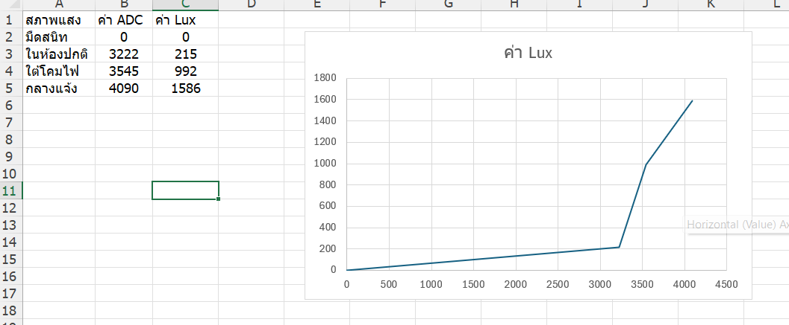

# **ใบงานปฏิบัติการ: การใช้งาน LDR และการทำ Calibration**


## **วัตถุประสงค์ของใบงาน**

1. เข้าใจหลักการทำงานของ LDR (Light Dependent Resistor)
2. ต่อวงจร Voltage Divider เพื่ออ่านค่าแสง
3. อ่านค่า ADC จากบอร์ดไมโครคอนโทรลเลอร์
4. เก็บข้อมูลจริง (ADC vs Lux จากมือถือ)
5. ทำกราฟความสัมพันธ์
6. สร้างสมการ Calibration เพื่อแปลง ADC → Lux
7. ทดสอบความแม่นยำหลัง Calibration

# **ส่วนที่ 1 — ความรู้พื้นฐาน**

## **1.1 LDR คืออะไร**


LDR (Light Dependent Resistor) หรือ Photoresistor คืออุปกรณ์อิเล็กทรอนิกส์ชนิดหนึ่งที่มี **ค่าความต้านทานเปลี่ยนตามความเข้มของแสง** ที่ตกกระทบ

- **แสงมาก → ความต้านทานลดลง**
- **แสงน้อย → ความต้านทานเพิ่มขึ้น**

LDR จึงเหมาะสำหรับงานตรวจจับความสว่าง เช่น ระบบเปิดไฟอัตโนมัติ, ระบบวัดแสง, ระบบควบคุมหน้าจอ, ระบบความปลอดภัย ฯลฯ


## **1.2 โครงสร้างและหลักการทำงานภายใน**

LDR ทำจากสารกึ่งตัวนำ เช่น **Cadmium Sulfide (CdS)** หรือ **Cadmium Selenide (CdSe)**
### เมื่อมีแสงตกกระทบ:
1. โฟตอนของแสงกระตุ้นอิเล็กตรอนในสารกึ่งตัวนำ
2. อิเล็กตรอนหลุดจากแถบวาเลนซ์ไปยังแถบคอนดักชัน
3. จำนวนผู้พาไฟฟ้าเพิ่มขึ้น
4. ความต้านทานลดลง

### เมื่อไม่มีแสง:

- อิเล็กตรอนกลับสู่สภาวะปกติ
- ผู้พาไฟฟ้าลดลง
- ความต้านทานเพิ่มขึ้นมาก (อาจถึงหลายร้อย kΩ)

##  **1.3 พฤติกรรมเชิงคณิตศาสตร์ (Transfer Function)**

ความสัมพันธ์ระหว่าง **ความต้านทานของ LDR (R_LDR)** กับ **ความเข้มแสง (Lux)** ไม่เป็นเส้นตรง แต่เป็นแบบ **Exponential / Power Law**

### **สมการทั่วไปของ LDR**


$$R_{LDR}=A⋅(Lux)^{−α}
$$

โดย
	
	$A$ = ค่าคงที่ขึ้นกับรุ่นของ LDR

	$α$ = ค่าคงที่ (ประมาณ 0.7–0.9)
	
	$Lux$ = ความเข้มแสง

ความหมายคือ:
- เมื่อ Lux เพิ่มขึ้น → R ลดลงแบบโค้ง
- ไม่ใช่ความสัมพันธ์เชิงเส้น

เพื่ออ่านค่า LDR ต้องใช้วงจร **Voltage Divider** เพื่อแปลงความต้านทาน → แรงดัน → ADC อ่านได้

##  **1.4 ทำไมต้องใช้ Voltage Divider**

LDR ให้ “ความต้านทาน” แต่ไมโครคอนโทรลเลอร์อ่าน “แรงดัน” ดังนั้นต้องใช้วงจร **Voltage Divider** เพื่อแปลง R → V

### วงจร Voltage Divider


 **สมการแรงดันที่อ่านได้**


$$V_{out}=V_{cc}⋅\frac{R_{fixed}}{R_{LDR}+R_{fixed}}
$$

เมื่อ:

- $R_{LDR}$ ลดลง (แสงมาก) → $V_{out}$ เพิ่มขึ้น

- $R_{LDR}$ เพิ่มขึ้น (แสงน้อย) → $V_{out}$ ลดลง

## **1.5 ช่วงค่าความต้านทานของ LDR**

ค่าทั่วไปของ LDR

| สภาพแสง  | ความต้านทาน   |
| -------- | ------------- |
| มืดสนิท  | 200 kΩ – 2 MΩ |
| ห้องปกติ | 10 kΩ – 50 kΩ |
| ใต้โคมไฟ | 2 kΩ – 10 kΩ  |
| กลางแจ้ง | 200 Ω – 2 kΩ  |

## **1.6 คำนวณแรงดันเอาต์พุตจากวงจร**

| สภาพแสง  | ความต้านทาน   | แรงดันเอาต์พุต (โวลต์) |
| -------- | ------------- | ---------------------- |
| มืดสนิท  | 200 kΩ – 2 MΩ |     0.010v    |
| ห้องปกติ | 10 kΩ – 50 kΩ |     2.85v      |
| ใต้โคมไฟ | 2 kΩ – 10 kΩ  |    1.84 v      |
| กลางแจ้ง | 200 Ω – 2 kΩ  |     2.00 v |


---
# **ส่วนที่ 2 — การต่อวงจร**

## **อุปกรณ์ที่ใช้**

- LDR
- R คงที่ 10 kΩ
- บอร์ด ESP32 / Arduino
- สาย Jumper
- แอปวัดแสงในมือถือ (Lux Meter)

## **วงจร Voltage Divider**


**เหตุผลที่ใช้ R 10kΩ:** เป็นค่าที่เหมาะสมสำหรับ LDR ทั่วไป ทำให้แรงดันอยู่ในช่วงที่ ADC อ่านได้ดี

## **ส่วนที่ 3 — การอ่านค่า ADC**

ตัวอย่างโค้ด ESP32 (ADC 12-bit)

```c
#include <stdio.h>
#include "driver/adc.h"
#include "esp_adc_cal.h"
#include "esp_log.h"

#define ADC_CHANNEL     ADC1_CHANNEL_6   // GPIO34
#define ADC_ATTEN       ADC_ATTEN_DB_11  // รองรับ ~3.3V
#define ADC_WIDTH       ADC_WIDTH_BIT_12 // 0–4095

static esp_adc_cal_characteristics_t adc_chars;

void app_main(void)
{
    // 1) ตั้งค่า ADC
    adc1_config_width(ADC_WIDTH);
    adc1_config_channel_atten(ADC_CHANNEL, ADC_ATTEN);

    // 2) ทำ Calibration (ใช้ค่า Vref = 1100mV)
    esp_adc_cal_characterize(
        ADC_UNIT_1,
        ADC_ATTEN,
        ADC_WIDTH,
        1100,              // ค่า Vref ของ ESP32 โดยประมาณ
        &adc_chars
    );

    while (1) {
        // 3) อ่านค่า ADC raw
        int raw = adc1_get_raw(ADC_CHANNEL);
        // 4) แปลงเป็นแรงดัน (mV)
        uint32_t voltage = esp_adc_cal_raw_to_voltage(raw, &adc_chars);
        printf("ADC Raw = %d, Voltage = %d mV\n", raw, voltage);
        vTaskDelay(pdMS_TO_TICKS(500));
    }
}
```

ค่าที่อ่านได้ (12 bit) จะอยู่ในช่วง **0–4095** 

## **ส่วนที่ 4 — การเก็บข้อมูลเพื่อทำ Calibration**

ให้นักศึกษาทำ 5–7 จุดวัด โดยใช้มือถือวัดค่า Lux เทียบกับ LDR โดยเปลี่ยนสภาพแสง ให้มีความแตกต่างกัน

**ตัวอย่างข้อมูล**

| สภาพแสง  | ค่า ADC | ค่า Lux (มือถือ) |
| -------- | ------- | ---------------- |
| มืดมาก   | 300     | 5                |
| มืด      | 450     | 20               |
| ห้องปกติ | 1200    | 150              |
| ใต้โคมไฟ | 2200    | 350              |
| กลางแจ้ง | 3500    | 1200             |

**เป้าหมาย:** สร้างกราฟ ADC → Lux เพื่อหาความสัมพันธ์

## **ส่วนที่ 5 — การทำกราฟ เพื่อหาสมการ**

ให้นักศึกษาใช้ Excel / Google Sheet
1. ใส่ข้อมูล ADC และ Lux
2. สร้างกราฟ Scatter
3. ใส่ Trendline
4. เลือก Linear หรือ Polynomial
5. ให้โปรแกรมแสดงสมการ

**ขั้นตอนการหาสมการ**
1. นำข้อมูลป้อนเข้าสู่ excel หรือ google sheet


2. เลือกข้อมูลเพื่อทำกราฟ scatter


3. แทรกกราฟ scatter


4. คลิกขวาที่เส้นกราฟ เลือก เพิ่มเส้นแนวโน้ม


5. ติ๊กที่ตัวเลือก 

	✅ แสดงสมการบนแผนภูมิ 

	✅ แสดงค่า R-squared บนแผนภูมิ

6. เลือกชนิดของกราฟ ที่ทำให้เส้นแนวโน้มทับเส้นข้อมูลมากที่สุด

	สังเกตุจากค่า R-squared ต้องเท่ากับ 1.000 หรือใกล้เคียงมากที่สุด

7. คัดลอกสมการ $y = ...$ ไปใช้ในโปรแกรม


สมมติว่า trend line ได้สมการเป็น $y = 0.42x-50$

แสดงว่ามีความชันของเส้นกราฟเป็น $m=0.42$ และมีจุดตัดแกน $y$  ที่ $b = -50$ ให้เขียน code แบบนี้

```c
Lux = 0.42 × ADC – 50
```

หรือถ้ากราฟไม่เป็นเส้นตรง  ให้ใช้ Polynomial เช่น สมมติว่าได้สมการเป็น $y = 0.0001 × x^2 + 0.3 x – 40$ ให้เขียน code แบบนี้

```c
Lux = 0.0001 × ADC^2 + 0.3 × ADC – 40
```

## **ส่วนที่ 6 — การทำ Calibration ในโค้ด**

ตัวอย่างแบบ Linear Fit

```c
float lux = 0.42 * raw - 50;
```

ตัวอย่างแบบ Polynomial:

```c
float lux = 0.0001 * raw * raw + 0.3 * raw - 40;
```

**หมายเหตุ** 

Code ที่ใช้ สามารถ reuse code  จากการ calibrate ค่ามุมในการทดลองที่แล้วได้


## **ส่วนที่ 7 — การทดสอบผลลัพธ์**

ให้นักศึกษาทดสอบ 3 จุดแสงใหม่ที่ไม่ได้ใช้ตอนเก็บข้อมูล เช่น:

| สภาพแสงใหม่ | ADC  | Lux มือถือ | Lux จากโค้ด |
| ----------- | ---- | ---------- | ----------- |
| ใต้โต๊ะ     | 600  | 40         | 38          |
| ห้องเรียน   | 1500 | 180        | 175         |
| หน้าต่าง    | 2800 | 500        | 520         |

ให้นักศึกษาวิเคราะห์ว่า

- ความคลาดเคลื่อนอยู่ในระดับที่ยอมรับได้หรือไม่
- ตอบ อยู่ในระดับที่ยอมรับได้
- สมการ Linear หรือ Polynomial เหมาะกว่ากัน
- ตอบ สมการ Polynomial มีความเหมาะสมมากกว่า

## **ส่วนที่ 8 — คำถามท้ายใบงาน**

1. ทำไมต้องใช้ Voltage Divider ในการอ่าน LDR?
 ตอบ ไมโครคอนโทรลเลอร์อ่านได้แค่แรงดันไฟฟ้า แต่องค์ประกอบ LDR เปลี่ยนแปลงค่าเป็นความต้านทาน ทำให้ต้องใช้วงจร Voltage Divider เพื่อแปลงค่าความต้านทานให้เป็นระดับแรงดันไฟฟ้าที่ ADC อ่านได้
2. ทำไมต้องเก็บข้อมูลหลายจุดก่อนทำ Calibration?
 ตอบ เนื่องจากความสัมพันธ์ระหว่างค่า Lux กับความต้านทานของ LDR ไม่เป็นเส้นตรง การเก็บข้อมูลหลายช่วงแสงจะช่วยให้สร้างเส้นแนวโน้ม และสมการที่แม่นยำครอบคลุมการใช้งานจริง
3. ถ้า Noise มากกว่าสัญญาณจริง จะเกิดอะไรขึ้น?
 ตอบ ค่า ADC จะมีความผันผวนและแกว่งไปมา ทำให้ค่า Lux ที่คำนวณได้เพี้ยนรุนแรงและไม่สามารถนำไปใช้ควบคุมระบบได้
4. ทำไมการวางตำแหน่งเซนเซอร์จึงสำคัญต่อ Signal Integrity?
 ตอบ เพราะทิศทางและระยะทางส่งผลต่อแสงสะท้อนรวมถึงสัญญาณรบกวนรอบข้าง หากตำแหน่งไม่ดีหรือสายสัญญาณยาวเกินไป จะทำให้ระดับแรงดันคลาดเคลื่อน
5. ถ้า ADC มี Resolution ต่ำ จะส่งผลอย่างไรต่อความแม่นยำ?
 ตอบ ความละเอียดในการแบ่งระดับแรงดันจะน้อยลง ทำให้ไม่สามารถแยกแยะการเปลี่ยนแปลงของแสงระดับเล็กน้อยได้ ค่า Lux ที่คำนวณได้จะขาดความละเอียด

## **ส่วนที่ 9 — ผลลัพธ์ที่คาดหวัง**

ผู้เรียนจะสามารถ:
- ต่อวงจร LDR ได้อย่างถูกต้อง
- อ่านค่า ADC ได้
- เก็บข้อมูลจริงและสร้างกราฟความสัมพันธ์
- ทำ Calibration เพื่อแปลง ADC → Lux
- ประเมินความแม่นยำของระบบวัดแสงที่สร้างขึ้นเอง

## **ส่วนที่ 10 —  Rubric ประเมินตนเอง**

### **ส่วนที่ 10.1 — ความเข้าใจพื้นฐาน LDR (20 คะแนน)**

| ข้อ | รายการ                                                         | คะแนน<br>(0–5 คะแนน) | เหตุผล |
| --- | -------------------------------------------------------------- | -------------------- | ------ |
| 1.1 | อธิบายหลักการทำงานของ LDR ได้ถูกต้อง                               |            5        |อธิบายได้ว่า LDR เปลี่ยนความต้านทานตามความเข้มแสง        |
| 1.2 | อธิบายการทำงานภายใน LDR (โฟตอน → อิเล็กตรอน → conduction band)    |           5        |เข้าใจการกระตุ้นของโฟตอนทำให้เกิดอิเล็กตรอนอิสระข้ามไป Conduction Band        |
| 1.3 | เข้าใจว่าความสัมพันธ์ R vs Lux ไม่เป็นเส้นตรง                           |           4         | เข้าใจ Non-linear|
| 1.4 | เข้าใจเหตุผลที่ต้องใช้ Voltage Divider                              |             4        |   เข้าใจว่า ใช้เปลี่ยนค่าความต้านทาน     |

### **ส่วนที่ 10.2 — การต่อวงจรและอ่านค่า ADC (20 คะแนน)**

| ข้อ | รายการ                              | คะแนน<br>(0–5 คะแนน) | เหตุผล |
| --- | ----------------------------------- | -------------------- | ------ |
| 2.1 | ต่อวงจร Voltage Divider ได้ถูกต้อง  |            5          |ต่อ LDR พ่วง R 10kΩ เข้าขา GPIO34 (ADC1_CH6) ได้ถูกต้องตามวงจร        |
| 2.2 | เลือกค่า R คงที่เหมาะสม (เช่น 10kΩ) |            4          |เข้าใจ ช่วงความต้านทานของ LDR ในสภาวะแสงทั่วไป        |
| 2.3 | เขียนโปรแกรมอ่านค่า ADC ได้ถูกต้อง  |             3         |เขียนโปรแกรมได้ถูกต้อง        |
| 2.4 | ใช้ ESP‑IDF ADC + Calibration ได้   |          3            |ใช้ ESP‑IDF ADC + Calibration ได้ แต่อาจมีข้อผิดพลาดเล็กน้อย        |

### **ส่วนที่ 10.3 — การเก็บข้อมูลจริง (20 คะแนน)**

| ข้อ | รายการ                             | คะแนน<br>(0–5 คะแนน) | เหตุผล |
| --- | ---------------------------------- | -------------------- | ------ |
| 3.1 | เก็บข้อมูล ADC อย่างน้อย 5–7 จุด   |              4        |บันทึกค่า ADC ครบถ้วนตามสภาวะแสงต่างๆ รวม 6 จุดทดลอง        |
| 3.2 | วัดค่า Lux จากมือถือได้ถูกต้อง     |               5       |ใช้แอป Lux Meter บนมือถือวัดค่าเทียบเคียงในตำแหน่งเดียวกับเซนเซอร์        |
| 3.3 | จดข้อมูลเป็นตารางครบถ้วน           |             5         |บันทึกตารางเปรียบเทียบระหว่าง ADC Raw และ Lux จากมือถือเรียบร้อย        |
| 3.4 | ควบคุมสภาพแสงให้คงที่ระหว่างการวัด |              4        |วาง LDR ชิดกับเซนเซอร์รับแสงของมือถือเพื่อรับแสงในสภาพเดียวกัน        |


### **ส่วนที่ 10.4 — การทำกราฟและสร้างสมการ Calibration (25 คะแนน)**

| ข้อ | รายการ                                        | คะแนน<br>(0–5 คะแนน) | เหตุผล |
| --- | --------------------------------------------- | -------------------- | ------ |
| 4.1 | สร้างกราฟ Scatter ADC vs Lux ได้              |             4         |พล็อต Scatter Chart ใน Excel โดยกำหนดแกน X เป็น ADC และแกน Y เป็น Lux        |
| 4.2 | เลือก Trendline เหมาะสม (Linear / Polynomial) |           3           |เลือก Trendline แบบ Polynomial        |
| 4.3 | อ่านสมการจากกราฟได้ถูกต้อง                    |             4         |    อาจอ่านผิดพลาดบ้าง    |
| 4.4 | นำสมการไปใช้ในโค้ดได้                         |           3           | มีการหาข้อมูลเล็กน้อย       |
| 4.5 | วิเคราะห์ว่า Linear หรือ Polynomial เหมาะกว่า |              4        |วิเคราะห์ได้ว่า Polynomial เหมาะกว่า เพราะครอบคลุมพฤติกรรม Non-linear ได้แม่นยำกว่า        |
### **ส่วนที่ 10.5 — การทดสอบผลลัพธ์และวิเคราะห์ (15 คะแนน)**

| ข้อ | รายการ                                   | คะแนน<br>(0–5 คะแนน) | เหตุผล |
| --- | ---------------------------------------- | -------------------- | ------ |
| 5.1 | ทดสอบจุดแสงใหม่ที่ไม่ได้ใช้ตอนเก็บข้อมูล |            5          |  ทดสอบครบ      |
| 5.2 | เปรียบเทียบ Lux มือถือ vs Lux จากโค้ด    |         4             | เปรียบเทียบค่าที่ได้จากโค้ด ESP32 กับแอปมือถือพบว่าใกล้เคียงกัน       |
| 5.3 | วิเคราะห์ความคลาดเคลื่อนและสาเหตุได้     |           3           |วิเคราะห์ได้บ้าง        |
.................................................................

###  **คะแนนรวมทั้งหมด:** `___81___ / 100`

###  **คำถามสะท้อนความเข้าใจ (Reflection)**

ให้นักศึกษาเขียนตอบสั้น ๆ

1. จุดไหนในใบงานที่คิดว่ายากที่สุด? ตอบ การควบคุมสภาพแสงให้คงที่ขณะเก็บข้อมูลเทียบกับมือถือ และการเลือกชนิดสมการใน Excel ให้ได้ค่า ใกล้เคียงกัน
    
2. ถ้าทำใบงานนี้อีกครั้ง จะปรับปรุงอะไร? ตอบ จะสร้างกล่องทดลองทึบแสงเพื่อลดแสงรบกวนจากภายนอก และเพิ่มจำนวนจุดเก็บข้อมูลให้ถี่ขึ้นเพื่อให้ได้สมการ Calibration ที่แม่นยำยิ่งขึ้น
    
3. ส่วนไหนที่คิดว่าตนเองเข้าใจดีมาก? ตอบ หลักการทำงานของวงจร Voltage Divider และขั้นตอนการนำสมการคณิตศาสตร์ที่ได้จาก Excel มาเขียนแปลงเป็นโค้ดภาษา C บน ESP-IDF

